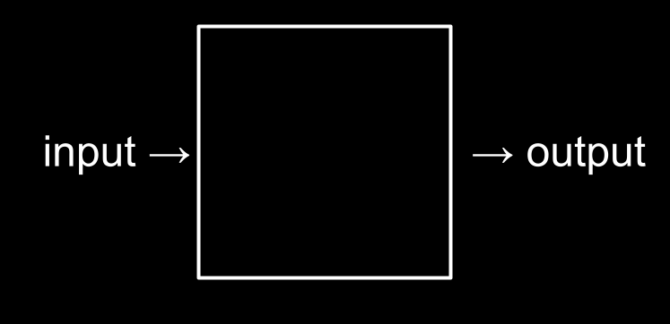

# What is Computational Thinking ?
Computer programming is all about solving problems, but you need to do this step-by-step.

First, you get input, then you do calculations. Output can be a solution or a step towards it.




## Numbers
Computers use **binary number system.** You represent values with **0** and **1**.

If you think of it like a light bulb, one light bulb can only count to 0 to 1. This is called **"base-2"** counting.

Using three light bulbs, this represents **0**;
```
0 0 0
```

This represents **1**;
```
0 0 1
```

This represents **2**;
```
0 1 0
```

This represents **3**;
```
0 1 1
```

This represents **4**;
```
1 0 0
```

We can count up to **7**;
```
1 1 1
```

You can think of it like this;
```
2^2 2^1 2^0
 |   |   |
 v   v   v
 4   2   1
```


Computers generally use eight bits (1 byte) to represent a number. For example **00000101** is number **5** in **binary**.

## Text
Just like numbers, characters are also represented by binary numbers.
**ASCII Standard** is created due to this same counting system. It's a number-char map table.

For referring to character **A**, you use number 65 to refer it.

If you want to render a text, you need to use **ASCII Table**.
Your message may look something like this;

```
H   I   !
72  73  33
```

**ASCII Standard** is **"world-wide standard"**

Here is a **ASCII Table**;
![[ascii-table.png]]

[**ASCII - Wikipedia**](https://en.wikipedia.org/wiki/ASCII)

## Emoji
There were no digits in **binary** to represent emojis, *Unicode Standard* is used for representing.

![[emoji-table.png]]

[**Unicode - Wikipedia**](https://en.wikipedia.org/wiki/Unicode)

## RGB
A colored pixel is a represention of 3 channels of color, **Red - Green - Blue**.
![[rgb-unicode.png]]

## Media Files (images, videos, etc.)
Images are simply collection of **RGB Data**.
Videos are collection of images played overtime for certain frame per second (fps).


**[Algorithms](./algorithms)**